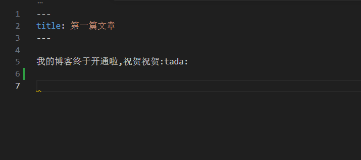

我的博客终于开通啦,祝贺祝贺:tada:

---

以下是测试内容

代码块:

```bash
echo "hello world"
```

```json
{
  "user": {
    "id": 8732,
    "profile": {
      "name": "Lena Chen",
      "age": 29,
      "city": "Oslo",
      "isActive": true
    }
  },
  "device": {
    "model": "Pixel 7",
    "stats": {
      "battery": 84.5,
      "storageUsed": 112.3,
      "lastSync": "2025-07-14T08:22:31Z"
    }
  }
}
```

gif图片:



表格:

| 列1 | 列2 | 列3 |
| --- | --- | --- |
| 1   | 2   | 3   |
| 4   | 5   | 6   |
| 7   | 8   | 9   |

视频(html):

<video src="./image/hello/1776083876658.mp4" controls width="100%"></video>

文本容器:

```
::: info
信息提示
:::

::: tip
技巧提示
:::

::: warning
警告提示
:::

::: danger
危险提示
:::

::: details
点击查看详情
:::

::: warning 注意
这是自定义标题的警告
:::

> [!WARNING] GitHub 风格的 Alerts
> 123
```

::: info
信息提示

dsadasdsa

a
da
das
dsda
as
da
das
das
:::

::: tip
技巧提示
:::

::: warning
警告提示
:::

::: danger
危险提示
:::

::: details
点击查看详情
:::

::: warning 注意
这是自定义标题的警告
:::

> [!WARNING] GitHub 风格的 Alerts
> 123

markdown emoji:

```md
:tada:
:smile:
:heart:
:+1:
:-1:
```

:tada:  
:smile:  
:heart:  
:+1:  
:-1: